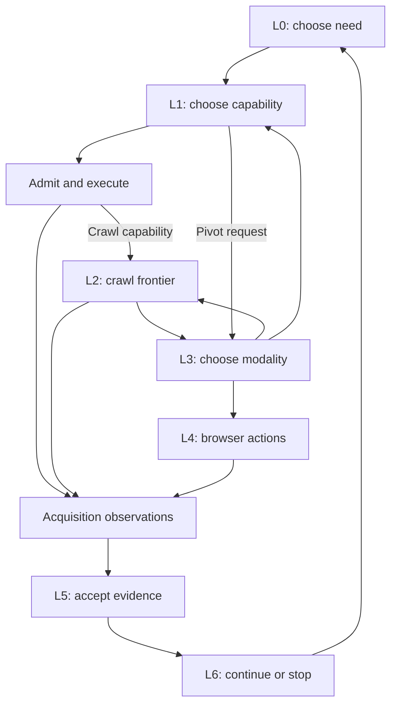

# Jev × Fl0sint Harness — Unified PRD
## MetaHarness policy, durable evidence, and multiple acquisition loops

**Owner:** Michael  
**Revision:** 3 — first-principles audit and independent component priorities, 25 September 2026  
**Target repository:** [n4s5ti/fl0sint](https://github.com/n4s5ti/fl0sint)  
**Status:** implementation specification; audited foundations exist, required repairs and new loops are not claimed complete.

This document consolidates the prior Jev/Flowsint PRD and the repository audit into one authoritative build specification. The audit findings below are implementation requirements with acceptance tests. No separate audit document is needed to build from this PRD. Source observations refer to pinned revisions, not assumed deployment state. Numerical release objectives are proposed gates, not achieved results.

## 1. Purpose and successful outcome

Build independently usable acquisition and evidence capabilities in Michael's existing Fl0sint fork, then compose them through **osint-decider**, the MetaHarness-backed decision runtime. The composed system compiles missing contact facts into bounded acquisitions, selects suitable tools, steers crawl threads, pivots between acquisition methods, controls a browser when justified, accepts evidence, and decides when to stop. The first deliverable is a usable source-preserving scraper, not completion of the runtime.

The defining example is:

> Given a particular person and organization, obtain the missing current work email with evidence establishing whose email it is. Choose a tool that can actually obtain it; follow promising website threads; pivot to the browser if relevant evidence requires interaction; return an accepted fact with provenance or an explicit unresolved outcome.

A generic company inbox, contact form, role placeholder, or syntactically valid guessed address does not satisfy a request for a named person's direct work email. Alternatives can be returned as separately typed partial results if the selected target profile permits them.

Fl0sint owns integrated acquisition execution and durable observation records. MetaHarness supplies selected control-plane capabilities as composition requires them. **Seven distinct decision contracts** preserve the separate roles for Jev; each initially supports direct user selection or a deterministic policy where feasible. Enable Jev per contract when comparative evidence justifies it. One optional oracle interface handles ambiguity, novel composition, and audit. Runtime code retains execution authority and factual acceptance rules.

**Immediate success:** a user supplies URLs or typed inputs and receives useful, correctly attributed observations and retrievable proof through a CLI or callable function. **Composed-system success:** lower cost per verified need than a fixed waterfall over comparable authorized tasks, without materially reducing completion or accepted-evidence precision. Insufficient evidence of optimization produces INCONCLUSIVE; it does not invalidate a useful acquisition component.

**Scope:** integration and narrow repairs in the existing fork, the generated sidecar, controlled crawler/browser adapters, evidence acceptance, outcomes and evaluation. No new Flowsint fork, replacement graph database, new UI, wholesale crawler rewrite, unrelated enrichment program, or automatic adoption of guessed private data. Document approval is not a claim that branches were merged, services deployed, or release gates passed.

### 1.1 First-principles audit: what actually creates value

The user's desired outcome requires a source to be acquired, relevant information to be recovered, and claims to be attributed correctly. Selecting among methods becomes valuable when alternatives differ materially. Learning becomes valuable only after reliable outcomes exist. These dependencies establish the build order; the presence of a named framework or seven decision contracts does not.

This is an architectural audit of revision 2 using its pinned repository findings. Priority judgments below are design inferences, not measured effort estimates, a fresh repository audit, or a claim that any component is already production-ready.

| Finding | First-principles test | Required change |
| --- | --- | --- |
| Critical: useful acquisition arrived too late | Can a user obtain a useful result before the complete runtime exists? Revision 2 put the crawler at P4 | Ship URL → source snapshot/text/links/candidates first; bounded crawl follows immediately |
| High: scaffold and infrastructure became product prerequisites | Does fetching one page require a planner, graph projection, model broker or distributed queue? | Keep only local admission, attribution, bounds and output proof on that path; add distributed controls when execution is distributed |
| High: seven roles implied seven model dependencies | Does each state need judgment, or is there one legal action or a sufficient rule? | Preserve the seven contracts; deterministic/direct policies are valid implementations. Model calls need measured incremental value |
| High: observations and accepted facts had the same release critical path | Is source text/contact extraction already useful before final person attribution? | Release clearly labeled observations independently; accepted-contact exports remain behind acceptance requirements |
| High: fixes across unrelated paths accumulated into one gate | Does an unused spreadsheet mapper or projection profile affect a graph-free scraper? | Gate the exercised capability and its reachable dependencies. Disabled unsafe paths remain unavailable; repair them before enabling them |
| Medium: browser rendering was bundled with autonomous interaction | Does JavaScript rendering require a model choosing clicks? | Ship explicit render-and-extract separately; add bounded interaction and then optional Jev action selection |
| Medium: whole-system evaluation blocked component delivery | Does proving correct URL/text association require 500 decision labels? | Use scoped component tests immediately; reserve comparative completion/cost gates for the autonomous system |
| Medium: one golden path could overfit the architecture | Does every contact investigation require crawl → browser? | Also prove direct-tool, static-only, dynamic-render-only and unresolved paths. Browser use is conditional |

**Priority rule:** first satisfy necessary integrity dependencies, then favor direct usable output, reuse across callers, small dependency surface and low repair burden. Rankings are qualitative until implementation measurements exist. For a known authoritative endpoint, its validated connector can precede crawling. For a known dynamic source, rendering can precede site-wide crawling. Prioritize the shortest trustworthy route to the requested output, not a fixed preference for scraping everywhere.

The first release must remain useful when Jev, the oracle, the planner and graph publication are disabled. Later releases must show what enabling each additional component improves. Section 19 defines the independent deliverables and their actual prerequisites.

## 2. Audited implementation baseline

### 2.1 Pin and reuse the existing branch work

| Reference | Audited commit | Relationship to main |
| --- | --- | --- |
| main | 6c21c3a76c4098c29b743a8aed77c7c7faa31b83 | Base; 1 August 2026, 02:39 UTC |
| feat/quic-gpu-accel | Same as main | Same tip |
| feat/template-preview-safety | 95cb826f6bddc81e14a2ab2e8313e3d80673b026 | 1 ahead, 0 behind |
| feat/template-structured-runs | 6bddb353a82f91f47ba35102bc8b8e25749a65e9 | 7 ahead, 0 behind |
| feat/graph-projection-connectors | 59e2d670f674b8cf7b32f19ef9e7f8d895d4422f | 13 ahead, 0 behind |

The progression is linear: main → preview safety → structured runs → graph projection/connectors. The latest branch includes the preceding work. **Recommended integration baseline:** evaluate and adopt the graph-projection-connectors changes through the project's normal integration workflow; do not rebuild these capabilities or treat the branches as independent competing implementations. Refresh branch state when implementation starts, record any drift, and validate compatibility and migrations. Reusing this branch does not require enabling all its services or projection features before releasing a standalone acquisition component. [S01]

The audit inspected committed source and focused tests and reproduced selected methods offline with mocked services. It did not run the full suite or inspect production. GitHub returned no recorded checks/runs for the latest branch tip during the audit; this is absence of CI evidence, not a pass or failure. Local, unpushed, externally hosted, and deployment-specific work remains outside that finding.

### 2.2 Existing components and precise reuse boundaries

| Existing implementation | Reuse as | Required extension or limitation |
| --- | --- | --- |
| EnricherRegistry | Candidate discovery by input type and metadata | Add tested predicate capabilities, result kind, source family, costs, implementation digest and controllability; reject name collisions |
| InputOutcome / StructuredExecutionResult | Canonical grouped acquisition outcomes | Map success/failure/hold plus diagnostics to the domain outcome taxonomy; preserve every input |
| EvidenceEnvelope / EvidenceEnvelopeRecord | Immutable acquisition evidence/provenance records | Add authorized source-artifact retrieval and references to independent acceptance verdicts |
| FlowRun / StepRun / ExecutionService | Execution IDs, idempotency, leases, attempts, checkpoints and reconstruction | Link receipts and budget reservations; preserve routing-context binding |
| GraphProjectionJob | Transactional evidence/outbox queue, retry and recovery | Distinguish retained observations from accepted assertions |
| Approved projection profiles | Reviewed graph mappings, identity and cardinality | Add contact profiles, scope enforcement and active-assertion semantics |
| DestinationRegistry / EgressAuthorizer | Deployment-owned connector destination/endpoint authority | Bind to the investigation's allowed capabilities and source scope |
| Immutable-ID template launch | Safer connector execution path | Receipt-controlled adapter, authorized evidence read and required acceptance gate |
| ReconCrawl / ReconSpread | Fetch/extract/discovery capabilities | One-step or genuine pre-fetch admission interface; no uncontrolled recursive job presented as a per-thread loop |
| Existing individual-anchor graph schema | Prospect output profile and E0–E3 vocabulary | Preserve profile intent; separate internal prerequisites from published contact results |

Sources: execution models [S02], durable service [S03], projection [S04], connector policy [S05], launch [S06], registry [S07], graph schema [S08].

**Existing code is not equivalent to universal coverage.** The durable connector-template route is distinct from legacy run_enricher. Legacy execute still invokes postprocessing/flush and can turn errors into empty arrays. Even the generic structured method does not itself guarantee graph quarantine. Every enabled acquisition adapter must pass staging and outcome tests.

The stock projection registry is empty; the connector destination registry also requires deployment configuration. Profile/destination declarations must be supplied, reviewed and exercised before these integrations are available. The inspected projection vocabulary centers on PARCEL/PARTY/INSTRUMENT, so contact-related mappings are new work. [S04][S05][S09]

## 3. Ownership, authority, and sources of truth

| Concern | Authoritative owner | What others may do |
| --- | --- | --- |
| Investigation scope and target profile | Runtime investigation contract | Workers inherit a narrower scope |
| Need state and acceptance criteria | Need ledger / acceptance service | Jev proposes ordering or continuation |
| Execution authority | Admission service + capability executor | Model selects existing candidate IDs |
| Acquisition results and observations | Fl0sint durable execution/evidence store | Sidecar references run/step/input/evidence IDs |
| Decision and authorization history | MetaHarness-backed receipt store | Links canonical execution records; no rival copy of execution truth |
| Source proof | Authorized artifact store linked from evidence | Supply scoped snapshots/spans to adjudication |
| Accepted factual assertions | Acceptance ledger and accepted graph view | Projection publishes only the designated view |
| Empirical routing history | Outcome learner derived from adjudicated outcomes | Influences selection within immutable constraints |
| Release truth and promotion | Frozen domain evaluator and promotion authority | Proposers see development failures, never rewrite truth |

Reuse Fl0sint's durable models. Do not create a second independent run/evidence database because the sidecar uses TypeScript. A shared PostgreSQL deployment with separate tables/schemas is acceptable; ownership and APIs, not database count, establish authority. Filesystem logs are diagnostic compatibility inputs, not the canonical outcome ledger.

For a standalone component, use the same versioned acquisition schema in a self-contained result bundle; it is the authoritative record of that isolated invocation, not a parallel mutable investigation database. On import into Fl0sint, preserve bundle/input/evidence IDs and origin digest, deduplicate ingestion, and return canonical execution references. Once imported, integrated outcome/acceptance state belongs to Fl0sint and the acceptance ledger. A saved result bundle is a supported interchange artifact, unlike legacy diagnostic logs. A local component does not require PostgreSQL, Neo4j, Celery, MCP or an oracle merely to produce observations.

Three states remain distinct:

1. **Execution succeeded:** structurally valid acquisition completed.
2. **Observation retained/projected:** source material and provenance were recorded.
3. **Assertion accepted:** attribution and exact predicate support passed policy.

Only state 3 may satisfy a contact need, populate verified export fields, or yield factual-success credit. Existing projection implements much of state 2; its tests intentionally project records marked unverified. This must remain explicit when profiles are enabled. [S03][S10]

## 4. Non-negotiable runtime invariants

- Every consequential action passes current admission and has an execution record/receipt; denied proposals never become execution capabilities. A single-process CLI uses a local admitted operation bound to inputs, scope and allocation. Distributed receipt consumption, leases and outboxes apply when work crosses process/service boundaries; they are not prerequisites to pure local extraction.
- Models choose among code-enumerated action IDs. No arbitrary tool name, URL, selector, graph mutation, credential or permission may be invented by a decision response.
- Each result retains originating input ID, action/step ID and source identity through concurrency, retries, filtering, deduplication and fan-out, plus requested/final URLs where applicable. Never reconstruct attribution using positional zip or a Cartesian input/result join.
- Hypotheses remain hypotheses until observed and supported. A role target is not a person; formatting validation is not contact verification.
- Acquisition workers cannot directly write to the accepted-assertion graph. A capture-only graph sink or isolated staging route covers every supported mutation path, including auto-flush and callbacks.
- Model preference, predicted yield, producer-declared confidence, evidence class, and accepted outcome are separate fields.
- Existing graph fields with unknown provenance remain unreviewed on import; field presence alone does not satisfy a need.
- A child thread/session inherits scope and a budget allocation from its parent. It cannot expand either or independently mark the parent need complete.
- The oracle cannot bypass admission, grant capabilities, create release truth, or reward an unexecuted alternative.
- Signed/hash-chained receipts establish record integrity, not factual accuracy. Secrets, final scorers, required cases, source grants and promotion rules stay outside mutable policy.

## 5. Target profiles and core contracts

### 5.1 Preserve both contact use cases

Support explicit profiles rather than silently replacing Michael's individual-anchor workflow:

| Profile | Output focus | Typical predicates |
| --- | --- | --- |
| individual_prospect | Authorized enrichment of existing person anchors | Attributed phone, social/profile URL, approved contact fields |
| work_contact | Person in an organizational context | Current work email, direct business phone, current role and affiliation |
| organization_contact | Organization-level contact route | Published office phone, general inbox, public contact form |

The first controlled multi-loop fixture uses work_contact. Production selection follows the investigation contract. Predicates and permitted sources are profile-specific; enabling one profile does not authorize all data classes. Preserve existing prospect display rules while permitting useful internal Domain/Website/Organization prerequisites. Internal discovery need not create visible prospect clutter. No sheet export occurs merely because a contact was found.

### 5.2 Required objects

These are domain contracts to implement around the existing execution models, not claims about current exports. Instantiate only the objects a component uses: standalone acquisition needs input/operation/evidence identity, not a synthetic Need or model decision. Fields specific to inactive models, graph state or parent investigations are explicitly not applicable rather than populated with invented values.

| Object | Minimum fields |
| --- | --- |
| Need | need_id, investigation_id, subject_entity_id, predicate, contact_kind, organization/context, as_of, priority, dependencies, acceptance_policy_version, status, generation |
| CapabilityDescriptor | capability_id, implementation/version digest, required_inputs, produces_predicates, result_kind, source_family, allowed_scope, credential availability, controllability, cost/latency model, rate/fan-out limits, staging certification |
| FrontierEntry | entry_id, thread_id, need_id, parent_entry_id, discovery_snapshot_id, canonical/request URL, anchor/context, page_kind, depth, attempts, status, source_family, generation |
| DecisionObservation | contract/version, source-state digest, applicable generations, target need, evidence references, legal candidate IDs, remaining budgets, backend/calibration versions |
| DecisionResult | selected_id or abstention, complete returned distributions, semantic preference, separately estimated verified yield, reason/evidence references, actual policy-selection distribution if stochastic |
| Handoff | handoff_id, parent/child IDs, need and bounded objective, start URL/entity, evidence/clue IDs, pivot reason, allowed capabilities/origins/actions, reserved child budget, expiry, return contract |
| AcceptanceVerdict | verdict_id, candidate/evidence IDs, subject/predicate/value, attributed source proof, freshness and independence results, label provenance, decision versions, ACCEPT/REJECT/REVIEW, supersedes/retracts references |
| AcceptedAssertion | assertion_id, investigation visibility, subject/predicate/value, acceptance_verdict_id, valid/observed dates, active/superseded/retracted status, originating run/step/input IDs |

Need statuses: OPEN, PENDING, SATISFIED, BLOCKED, EXHAUSTED, CONTRADICTED. Expired or retracted support reopens a previously satisfied need when its contract still applies. A deterministic compiler creates known prerequisite DAGs; an oracle may propose a new bounded composition only when deterministic capability closure cannot supply one. Validate it before adding needs.

### 5.3 Confidence semantics

**Choice probabilities are relative preference among the offered candidates. They are not automatically the probability that a tool will recover an accepted contact fact.** Store these separately:

- semantic_preference: bounded model ranking;
- predicted_verified_yield: separately defined and calibrated likelihood of recovering this predicate within the allocation;
- empirical_yield: observed, context-matched results and uncertainty;
- producer_confidence: metadata supplied by an extractor/template;
- evidence_class: E0–E3 classification;
- acceptance_verdict: factual disposition under the evidence policy.

E0 is a guess, E1 a plausible inference, E2 qualified single-source support, E3 qualified independent corroboration. Two tools returning the same copied source are not E3. The current fixed confidence formula and template confidence default do not become calibrated certainty. Lower source-quality facts do not become true by agreement between models.

## 6. Seven decision loops and their composition

Each loop has a separate contract, state, legal action set and outcome. They are functions/controllers, not seven autonomous chat agents. Model-backed implementations require separate calibration; deterministic implementations do not fabricate probability estimates. A standalone caller can choose a URL/tool directly without creating a Need or traversing all seven loops. In composed operation the runtime supplies the Need and parent context.

| Loop | Input state | Bounded decisions | Return/termination |
| --- | --- | --- | --- |
| L0 Need selection | Open needs, dependencies, priority, available evidence | SELECT_NEED, GATHER_PREREQUISITE, DEFER | One eligible need or request L6 stop evaluation |
| L1 Tool selection | Exact predicate, available inputs, eligible capabilities and empirical priors | SELECT_CAPABILITY / SELECT_ENRICHER, ABSTAIN | One admitted acquisition or L3 pivot request |
| L2 Crawl frontier | Observed leads, thread history, page clues, novelty and budget | FOLLOW, EXTRACT_NOW, DEFER, PRUNE_THREAD, BACKTRACK, STOP_THREAD | New observation/frontier, L3 pivot request, or bounded exhaustion |
| L3 Modality pivot | Unresolved need, current method results, observed blockers, alternatives | STAY_STATIC, SWITCH_TOOL, SWITCH_SOURCE, OPEN_BROWSER, RETURN_TO_PARENT | Accepted/rejected handoff; same parent need persists |
| L4 Browser action | Fresh DOM/accessibility snapshot and allowed action IDs | SELECT_ACTION, EXTRACT_NOW, DONE, STUCK | Evidence, NO_PROGRESS, BLOCKED_AUTH, or budget stop |
| L5 Evidence acceptance | Candidate value, identity, source proof, exact predicate and conflicts | SAME_ENTITY, SUPPORTS_PREDICATE, RANK_SOURCE, REQUEST_CORROBORATION | Deterministic ACCEPT/REJECT/REVIEW verdict using those signals |
| L6 Continue/stop | Accepted needs, conflicts, available branches, marginal yield and limits | CONTINUE, BRANCH, STOP, ESCALATE | Next eligible work or explicit investigation terminal outcome |

L3 may choose a direct browser session when already justified by an observed seed; no mandatory failed crawl is required. Each action or delegated session is admitted. All modalities return to the same evidence/need ledger. Browser DONE means the session produced its bounded return, not that a contact fact is accepted.

Hard stops for denied scope, revoked authority and exhausted required budgets are deterministic. They do not wait for a Jev judgment or require a fresh execution receipt to stop safely. L6 judges discretionary continuation only within the remaining permitted envelope.

## 7. L0 and L1: missing fact to useful tool

### 7.1 Compile the actual missing information

Read the accepted, current assertion view for the selected target profile. Construct a Need only where its acceptance predicate is unsatisfied. Distinguish a missing direct email from a known general inbox, unknown affiliation, stale contact, conflicting observation, or already pending acquisition.

Known dependency example: current person/company affiliation → official organization domain → attributable staff/profile page → current work email. Each prerequisite has its own acceptance criteria. A hostname-derived company name or generated role-person cannot silently satisfy identity.

### 7.2 Enumerate capable actions before asking Jev

Start with registry input-type compatibility, then apply tested capability metadata: can this implementation produce the required predicate, directly or as a prerequisite; does it retrieve observations or generate hypotheses; can it run under the available scope, credentials, budgets, and staging guarantee?

Cold start uses semantic suitability and conservative source-diverse exploration among eligible capabilities. Maintain contextual historical arms keyed by contract, predicate/contact kind, entity type, source family, and scope class. If the installed AgentPool API is not contextual, wrap isolated pools with explicit persistence rather than claiming unsupported behavior.

Bound choice sets by the measured backend limit; initially cap at 12 total selectable outcomes including ABSTAIN, log excluded alternatives, and retain source diversity. Do not permanently exclude useful unfamiliar arms solely because they lack history. Conditional narrowing or hierarchical selection must retain the original legal candidate inventory for audit and recall evaluation.

### 7.3 Choose, admit, acquire, and return

Begin with explicit user selection or a versioned deterministic ordering over tested eligible capabilities. When reliable measurements/model signals exist, compare a policy combining semantic suitability, calibrated predicted yield, empirical outcome uncertainty, marginal information value, cost, latency and duplicate-work penalty. All included weights and normalization are explicit configuration; unavailable estimates remain unknown. Never multiply unrelated uncalibrated probabilities into a claimed factual confidence.

A chosen capability must pass section 12 admission. Execute one enricher or one bounded adapter step first. Short saved flows are eligible only after their actual field mappings, input grouping, output schemas and fan-out limits pass adapter tests. The audited orchestrator forwards whole previous outputs and does not enforce the declared field mapping, so type-metadata compatibility alone is insufficient. [S11]

The action returns canonical per-input acquisition outcomes, observation references and actual resource use. L5 decides factual acceptance; L0/L6 decide next work. A returned list of contacts, task COMPLETED, valid email syntax, or oracle confirmation cannot independently mark the need SATISFIED.

## 8. L2: Spider/crawler frontier and thread selection

### 8.1 Integration contract

“Spider” names the controlled scraping role in this architecture. The audited repository currently wraps ReconCrawl and ReconSpread; it does not establish a deployed Spider SDK/service or a controllable browser. Select and pin the actual implementation in P0. A new adapter may wrap an existing one-page fetch/discovery operation. Do not replace the whole crawler unless a proven inability to expose that boundary makes it necessary.

The adapter must support either:

- one admitted page fetch/extraction at a time, returning observed links and candidates; or
- an explicit callback that obtains admission before every next fetch, with a bounded batch reservation when concurrency is permitted.

The existing fixed recursive calls do not meet this contract. Returning their results to Jev after a 500-page crawl does not retroactively govern the explored paths. ReconSpread discovery callbacks must not write directly into the accepted graph. [S12][S13]

Required adapter operations are fetch_page(receipt_id), extract_snapshot(snapshot_id, extractor_version), enumerate_links(snapshot_id), and cancel_or_checkpoint(session_id). These are proposed internal contracts. Response fields include input/receipt ID, requested and final URLs, typed HTTP/execution status, snapshot reference/digest, extraction spans, observed link metadata, and actual costs/timing. Redirects and subrequests must pass the same origin/scope controls; a limit after download is not a pre-fetch limit.

Snapshot extraction/link enumeration may run as pure local operations within the admitted parent reservation. Any extractor that invokes a model/network service or incurs separately bounded costs requires its own admitted action or an explicitly covered allocation. Snapshot access remains scoped even for local extraction.

### 8.2 Durable frontier

A **thread** is a research branch targeting a need, such as a staff bio, a current affiliation, or a published department contact. A **frontier entry** is one observed lead within a thread. Maintain both identities. Normalize URLs without destroying meaningful query distinctions; track content fingerprints, pagination/template patterns, visited generations, and source-family lineage.

L2 receives only a bounded view of the frontier plus current clues and ledger changes. It evaluates:

- likelihood of finding support for the exact target predicate;
- fit to the intended entity;
- source authority and freshness cues;
- novelty compared with already inspected pages;
- marginal cost, depth and remaining alternatives.

FOLLOW chooses an observed entry ID. EXTRACT_NOW selects an approved extractor for the current snapshot. DEFER keeps a recoverable lead. PRUNE_THREAD stops a specific branch with a reason. BACKTRACK restores a prior branch frontier without inventing new URLs. STOP_THREAD returns exhaustion or saturation to L6. None of these deletes observations or proves a fact does not exist.

Fetch/extract results preserve per-candidate source URL and span; logging source_url and then dropping it from structured outputs is prohibited. One page may contain contacts for several entities; page association is not person attribution.

### 8.3 Budgets and progress

Initial development limits: 30 pages/site, depth 3, at most five repeated-template pages, and two browser pivots/need. Production values are versioned profile configuration selected from measured coverage; these seeds are not proven performance thresholds. Also bound response bytes, redirects, domains, elapsed time, concurrent requests, and per-source rate.

Progress is newly accepted support or new nonduplicate evidence that can resolve the target need or an explicit prerequisite, including target evidence awaiting corroboration. New page count alone is not progress. Repeated templates, duplicate content, repeated same action/state, and revisiting failed leads trigger bounded recovery or L3/L6 review. Persist frontier state before handing off or exiting so resume does not spend the same budget again.

## 9. L3: modality pivot and handoff

This controller is separate from link ranking and browser clicks. It compares eligible ways to continue the **same unresolved need**.

| Observable state | Eligible pivot | Required qualification |
| --- | --- | --- |
| Useful static links remain | STAY_STATIC | Expected marginal value exceeds alternatives within policy |
| Relevant content appears script-rendered or behind a public interaction | OPEN_BROWSER | Specific observed seed and bounded interaction objective |
| Newly verified entity/domain unlocks an enricher | SWITCH_TOOL | Typed inputs and tested capability contract now satisfied |
| Current source family is exhausted or correlated | SWITCH_SOURCE | An allowed independent source/lead exists |
| Child session stuck or has completed its scope | RETURN_TO_PARENT | Return evidence, blockers, costs and checkpoint; parent decides next work |

An HTTP error, rate limit, access restriction or low-confidence model answer alone does not justify a browser. Preserve explicit reasons such as STATIC_CONTENT_INSUFFICIENT, INTERACTION_REQUIRED, BETTER_CAPABILITY_AVAILABLE, SATURATED_SOURCE, and BROWSER_NO_PROGRESS. Alternative modalities must honor the same source restrictions; browser use is not an access-control bypass.

Before dispatch, the parent reserves a sub-budget and emits a Handoff bound to its receipt and need generation. Acceptance is atomic with child ownership/lease acquisition. The parent pauses that work item or continues other independent needs; it does not duplicate the same active child objective. Rejected handoffs release reservations. Completion reconciles actual usage, releases unused allocation and returns one attributable result. A child cannot independently claim factual completion.

Browser returns may re-enter Spider when rendered content exposes usable static links or a verified domain unlocks a Fl0sint tool. Record pivot ancestry and cap repeated method cycles for the same need/seed/state. A browser pivot's success is evidence yield beyond the accessible static path, not simply launching a browser.

## 10. L4: bounded browser interaction

The browser worker receives the Handoff and creates a fresh DOM/accessibility snapshot. The Spider snapshot is context, not a current browser action map. Runtime code enumerates allowed actions from the fresh state; each action ID is bound to snapshot/session generation, target, and permitted parameters.

Isolate cookies, local/session storage, caches, downloads and credentials by authorized investigation/session. Reused workers must create or restore only the correctly scoped browser context. A valid URL does not authorize access to another investigation's cached evidence or authenticated state.

For each iteration:

1. Observe fresh state and enumerate legal actions.
2. Ask Jev to choose an action ID, EXTRACT_NOW, DONE or STUCK.
3. Admit the choice against current session generation, scope, time, action and monetary limits.
4. Execute one action and capture the resulting state.
5. Verify whether the expected page change occurred; preserve evidence and return to step 1 or terminate.

An approved action schema may allow entering a bounded, runtime-supplied search term into an observed search control. This does not permit arbitrary model-written scripts or selectors. Stale action IDs are rejected and trigger a bounded re-observe. Repeated actions with unchanged state, navigation loops and extraction without new evidence consume a bounded recovery allowance.

Allowed default actions include public navigation, expanding a contact card, selecting a relevant tab, controlled scrolling, and an approved site search. Login, messaging, purchases, contact-form submissions, uploads, or other consequential submissions require separately granted capabilities; otherwise return BLOCKED_AUTH or POLICY_BLOCKED. The worker cannot improvise credentials.

Returns: EVIDENCE_FOUND, NO_PROGRESS, STUCK, BLOCKED_AUTH, POLICY_BLOCKED, or BUDGET_EXHAUSTED, with source snapshots/spans, observed/final URLs, action trace, actual cost, and remaining checkpoint. These are acquisition outcomes. L5 alone determines accepted contact support. A screenshot/DOM may substantiate visible text, but a model's browser summary without source evidence does not.

DONE is the model's stop command, normalized to EVIDENCE_FOUND when supported candidate observations are returned and NO_PROGRESS when none are returned without a blocker. Preserve STUCK, BLOCKED_AUTH and other explicit failure/limit states rather than overwriting them with DONE. None of these is factual acceptance.

Pin and inspect the chosen browser implementation, license and action surface before its component milestone; inspect its model adapter before enabling Jev actions. Jev Browser is a candidate reference, not an already integrated dependency. [S23]

## 11. L5: observations, adjudication, and accepted assertions

### 11.1 Hypothesis → observation → acceptance

Preserve three distinct data kinds:

| Kind | Examples | Permitted use |
| --- | --- | --- |
| Hypothesis / RoleTarget | support@domain guess; “Company CEO”; inferred social slug | Guide approved discovery; never satisfy a factual need |
| Observation | Exact contact value extracted from a retained source span | Stage, compare, corroborate, optionally project in an explicitly uncertain observation view |
| AcceptedAssertion | Exact subject/predicate/value supported under policy | Satisfy need, verified export, outcome credit |

Do not relabel guessed output as observed merely because it passed through a tool. A hostname-derived company label is not verified organization identity. Format validators establish syntax only. Existing unknown graph records enter the new system as unreviewed; no silent retroactive “verified” label or bulk destructive cleanup is required.

The canonical acquisition model remains InputOutcome / EvidenceEnvelope. CandidateEvidence is a domain view/reference over retained outputs, extraction identity and source artifacts. Do not create divergent copies with separately mutable outcomes.

Existing input_ref is a content hash, so identical inputs can share it. Preserve occurrence lineage using run_id, step_id, attempt, input_index and input_ref, plus the originating seed/entity ID. Deduplication may share content artifacts but cannot erase distinct input ownership, outcomes or retry history. [S02][S03]

### 11.2 Source proof

Every factual candidate records originating input ID, requested/final URL or approved source record locator, source family/origin, retrieved/event times, artifact digest/reference, extraction method/version, exact supporting span or structured field pointer, and subject-attribution evidence.

The artifact reference must resolve through an authorized retrieval path. The audited connector's digest/reference does not itself retain the body. Implement retention-controlled capture of supporting material or an explicit revalidation policy. A hash without inspectable material cannot independently verify the original source claim. Keep secrets and credential-bearing transport details out of receipts and model context; retain the minimum authorized source content needed for review.

Template source_rights is producer-declared metadata, not retention authority. The existing unspecified-rights check does not make any other arbitrary string an authorization grant. Resolve retention permission from reviewed source policy and bind its content digest/version into provenance and acceptance. If acquisition occurred but retention is held, preserve RETENTION_HOLD and its reason without retaining prohibited material or creating factual-success credit. [S31]

Track common origin so multiple aggregators/tools do not fabricate source independence. Freshness uses source event/effective dates when available, plus retrieval time and predicate-specific expiry; fresh retrieval alone does not make an old fact current.

### 11.3 Adjudication questions and deterministic acceptance

Jev provides separate signals for SAME_ENTITY, SUPPORTS_PREDICATE, SOURCE_RELEVANCE, and whether corroboration is needed. Code performs schema, identity-key, source availability, freshness, permitted data-class and conflict checks. High-impact ambiguous identity or unsupported source claims remain REVIEW or require independent corroboration.

Accept only when all required evidence-policy conditions pass:

- the candidate is an observation with retrievable support;
- the subject matches the target entity at the relevant scope/date;
- the exact requested predicate and contact kind are supported;
- required freshness, source rights/authority and independence pass;
- material contradictions are resolved or explicitly prevent acceptance;
- the acceptance verdict references the source IDs and immutable rule versions.

Label provenance is one of deterministic_witness, source_grounded, independent_corroboration, human_anchor, or oracle_provisional. An oracle-provisional answer alone cannot be a release truth label. Producer confidence and free-text verification_state cannot mint ACCEPT. The oracle sees sufficient source excerpts, context and truncation markers; an arbitrary 4 kB model summary is not assumed sufficient evidence.

### 11.4 Two graph views, retraction, and scope

Reuse provenance-preserving observation projection where configured, but expose it as uncertain source material. Add an **accepted assertion view** driven by an AcceptanceVerdict. Need completion, verified export and reward queries use only active, current accepted assertions.

Projection can preserve conflicting observations without asserting both are current truth. Supersession or retraction appends a new verdict/event and changes the active view; original source evidence remains. Prevent stale projection jobs or replay from reactivating retracted assertions. Graph writes and acceptance events require idempotent identity and version/generation checks.

Existing source-scoped projection keys do not by themselves establish investigation authorization. Define and test record visibility per principal/investigation before exposing projected data. Either namespace projected records by the authorization boundary or enforce an explicit access mapping on every read/write. Global identity reuse is not permission to share private evidence across investigations.

Approved profiles must cover the chosen contact/entity vocabulary and cardinalities. Existing empty registries remain fail-closed until a reviewed profile is configured.

### 11.5 Acquisition outcomes and evidence outcomes are different

Map existing SUCCESS/FAILURE/HOLD plus diagnostics into a normalized acquisition code without discarding original status:

| Acquisition code | Meaning |
| --- | --- |
| SUCCESS_WITH_OUTPUT | Operation produced structurally valid output; factual disposition is separate |
| VALID_NO_RESULT | Valid inputs, completed authorized acquisition and no returned candidates; no suppressed failure |
| RATE_LIMITED / TIMEOUT / TOOL_ERROR | Collection failed or was interrupted for the stated reason |
| INVALID_INPUT | No acquisition for the invalid input; preserve its input_ref and diagnostic |
| POLICY_DENIED | Action not executed under current grants |
| RETENTION_HOLD | Preserve existing HOLD and its reason, such as source_rights_unspecified, after acquisition; no factual acceptance or reward while unresolved |
| PARTIAL | Some expected work succeeded and some did not; preserve per-input/subrequest states |
| UNKNOWN_OUTCOME | Existing evidence cannot distinguish valid empty, suppressed error or uncertain completion |

A legacy empty array without a reliable success witness maps to UNKNOWN_OUTCOME. If outputs exist but all are rejected or hypothetical, record successful acquisition plus those evidence dispositions; do not call the contact need satisfied. Aggregated COMPLETED or HTTP 200 is never the factual outcome.

## 12. Admission, receipts, budgets, and replay

### 12.1 Pre-execution admission

Runtime admission verifies current principal/investigation permissions, source/data-class scope, candidate membership, immutable capability/flow/template digest, typed inputs, current need/seed/frontier/browser generation, adapter staging certification, credential availability, circuit/rate state, estimated resource use, and successful budget reservation. Soft selection thresholds are contract-specific and calibrated. Hard policy failures are excluded from execution even if Jev or the oracle prefers the action.

Use installed MetaHarness PolicyGate/CircuitBreaker/RetryBudget and applicable budget utilities after checking exact semantics. Its checkGates worker-output verification API must not be misrepresented as verification of a future result; use it only where its post-result semantics fit. Domain admission remains explicit.

These semantics must also work without a model or framework service. The local CLI validates an explicit caller request, creates a local admitted operation and invokes the same acquisition implementation used by the integrated executor. Do not maintain a less-restricted alternate scraper implementation. Standalone extraction uses a scoped source snapshot and local allocation; distributed replay/lease requirements below activate only with distributed execution or resumable cross-process work.

### 12.2 Executable receipt

For composed execution, fields include receipt_id, decision_id, principal/investigation, need_id and generation, loop/contract, source-state digest, applicable registry/frontier/session generations, candidate-set digest, selected capability/action and immutable version, validated parameter/seed references, available choice/yield estimates, policy/calibration/backend versions, reserved resources, parent/handoff reference, expiry, and admission verdict. Absent model or parent context is explicitly not applicable. The standalone record retains the selected operation, caller scope, input/state and policy digests, implementation version, allocation, expiry and admission result; it does not fabricate a model decision or require the need ledger.

Bind the resolved endpoint-policy, projection-profile and retention-policy content digests into the operation identity. A template digest alone does not detect changed deployment registry content. The inspected connector registry's policy_version denotes its document format version, not a unique configuration revision; it cannot substitute for a content digest. Configuration drift invalidates the old admission. [S05]

The public executor accepts receipt_id and reconstructs the operation. It cannot accept a replacement FlowBranch, new URL, arbitrary selector, or switched target from the host. A stale receipt fails before provider dispatch.

Store the actual stochastic behavior distribution or deterministic policy version for evaluation. A Jev Choice vector is not automatically the executed policy's propensity after filters, reranking and tie-breaking.

### 12.3 Distributed execution and idempotency

Claim the receipt once, bind it to the canonical FlowRun/idempotency key, and dispatch through a durable outbox or equivalent recoverable protocol. Existing branch leases and fencing guard stale workers. If a network timeout leaves dispatch uncertain, reconcile by the same identity; do not mint a second receipt to retry blindly. Provider-level exactly-once execution is not assumed when unsupported.

A retry needs a recorded retry decision and reservation, or must be explicitly covered by the original bounded retry allocation. Deduplicate completed outcome ingestion and factual credit. Repeated callbacks, task replay, graph retries and parent-child returns must not consume success credit twice. Preserve canonical input cardinality and routing context.

### 12.4 Budget dimensions and boundaries

Track monetary spend, model calls/tokens, enricher calls, pages, browser actions, bytes, elapsed time, concurrency, fan-out and oracle calls independently. Parent reservations cap child spend; unused allocation returns on a terminal child result. Costs are reconciled even when evidence is rejected. Resumes preserve consumed resources.

Runtime network/credential ownership must make receipt-only authority real. Close the native legacy launch-permission gap and prevent the decision host/worker from reaching an alternative unrestricted launch path with execution credentials. Authenticated does not mean authorized for the supplied sketch. The newer connector route's permission check should be preserved and matched by supported legacy routes. [S06][S14]

Page/tool text is untrusted content; it cannot change legal action sets, policies, grants, budgets or acceptance rules. Restrict crawler/browser egress to the admitted source scope including redirects and subrequests. Restore certificate verification in the optional QUIC path before enabling it for trusted acquisition; transport optimization does not add a browser decision loop. [S15]

## 13. L6, oracle, and external interfaces

### 13.1 Continue or stop

L6 considers accepted needs, unresolved prerequisites, material conflicts, remaining diverse sources, estimated marginal verified gain, pending children and remaining resources. It returns a typed outcome:

| Investigation outcome | Condition |
| --- | --- |
| SATISFIED | Required exact predicates have active accepted support |
| PARTIAL | Accepted alternatives/prerequisites exist but required predicates remain unresolved |
| NOT_FOUND | The declared bounded search envelope was exhausted successfully without accepted support |
| INCONCLUSIVE | Material uncertainty, UNKNOWN_OUTCOME, unresolved conflict or insufficient verification remains |
| BUDGET_EXHAUSTED | A required resource limit prevents continuation |
| POLICY_BLOCKED | Allowed capabilities cannot perform necessary work |

NOT_FOUND does not assert that the fact does not exist. Do not prune an entire need solely because a relative Choice confidence is low, or force further collection after it is satisfied. Correlated no-results reduce expected value without establishing independent negative evidence. Pending uncertain dispatch must be reconciled before a clean terminal result.

### 13.2 One oracle interface

Escalate unresolved attribution, novel bounded composition, consequential ambiguity, or a stratified audit sample. Returns: CONFIRM, OVERRIDE_EXISTING_ACTION, REQUEST_EVIDENCE, PROPOSE_BOUNDED_PLAN, STOP, or ABSTAIN, with cited evidence/receipt IDs. Novel plans are compiled and validated into legal candidates before use.

An override is readmitted under the same immutable gates. It does not execute directly, grant source access, mark unsupported evidence true, or penalize an unexecuted alternative as if its outcome were observed. Start with one configured oracle model; model-tier routing is optional after an adequate labeled comparison corpus exists.

Use a configured per-investigation cap and at most one oracle adjudication per unchanged decision state by default. New evidence can justify a new versioned adjudication. If review is required but its budget is exhausted, return INCONCLUSIVE or BUDGET_EXHAUSTED rather than silently omitting it. Audit confident successes, confident rejections, no-results, pivots and stops, with stratification and sampling probabilities retained.

### 13.3 Actual Fl0sint APIs and required adapters

Audited main uses node_ids and sketch_id for single-enricher launch and saved-flow-ID launch. It does not accept arbitrary FlowBranch arrays as described in early drafts. Bind the actual saved flow/template digest, seed identities and scope in the receipt. Connector templates on the candidate branch have immutable-ID launch with an idempotency key. [S06][S16]

The scan read response exposes id/sketch_id/status. Newer connector scan details deliberately omit mapped outputs. **Required new interface:** an authenticated evidence-read adapter/API scoped to investigation and canonical run/step/input/evidence IDs, returning authorized candidates, diagnostics, provenance and retrievable source proof. Preserve safe status redaction; do not make get_scan a blanket raw-output endpoint or use broad direct database credentials as a shortcut. [S17][S25]

Public sidecar MCP surface: investigation.inspect, investigation.run_step, investigation.resume, investigation.cancel, investigation.receipts, and evidence.inspect. These expose bounded operations with access checks; mutation primitives stay internal. Internal broker and adapter calls do not require a return to the host after each click. Keep host call caps distinct from internal per-investigation budgets.

Compatibility ingestion may read flow JSON logs, but they are rewritten snapshots rather than append-only JSONL, and standalone enricher tasks do not produce the same flow log. A watcher must tolerate transient incomplete writes and validate stable snapshots. Durable execution records become authoritative; logs must not silently reconstruct missing truth. [S11]

## 14. Required repairs from the repository audit

These are dependencies of the capabilities they affect. An affected capability stays unavailable until its repair passes the relevant test. Exclusions are explicit in each release manifest: an observation-only scraper does not wait for spreadsheet, graph or saved-flow repairs when none of those paths is reachable. Applicable attribution, source-proof, outcome, scope and resource tests remain mandatory. Required full-system cases cannot be dropped when claiming the complete multi-loop release. The identifiers below connect observed defects to the phased build and acceptance suite.

| ID | Observed behavior at the audited revision | Required implementation and proof |
| --- | --- | --- |
| FIX-01 Source attribution | website/to_text collects completion-order results, drops failures, then zips them to original inputs; mocked execution reproduced swapped/wrong attachments [S15] | Carry input IDs in each future/result and preserve failed inputs. Test reversed completion, middle failure, duplicate values, retry and fan-out; no positional inference. TA01 |
| FIX-02 Synthetic contact truth | Contact enrichers generate role-address aliases, role-named Individuals, guessed personal emails and social URLs, then create contact relationships [S20][S21] | Emit typed hypotheses with generation method. Only witnessed support may create accepted HAS_EMAIL/contact/person assertions. Role targets and general routes remain distinct. TA02 |
| FIX-03 Relationship and export lineage | individual/to_org joins every original person to every result; sheet script correlates outputs by index and includes domain/username-to-LinkedIn placeholder mappings [S26][S27] | Preserve per-input relationship ownership and row IDs across zero/many results; validate output predicates before export. Two people/two organizations produce only supported pairings. Disable placeholder mappings. TA03 |
| FIX-04 Writes before acceptance | Legacy execute calls postprocess and flush; graph batches auto-flush at capacity; discovery callbacks can mutate graph directly [S18][S19][S13] | Use the existing graph-service injection seam where sufficient; cover every supported writer with a capture sink/staging route. Exercise more than a full batch and direct callbacks. No acquisition path obtains accepted-view write credentials. TA04 |
| FIX-05 Ambiguous and invalid outcomes | Legacy exceptions return []; tasks can then mark COMPLETED. All-invalid preprocessing can return the original inputs. Output metadata does not validate runtime output; crawler/link shapes diverge from declarations [S18][S32][S12][S13] | Fail closed for invalid inputs, validate per-input outputs, retain typed errors and partials, and map legacy ambiguity to UNKNOWN_OUTCOME when truth cannot be recovered. Never infer VALID_NO_RESULT from [] alone. TA05 |
| FIX-06 Unsafe composition | Orchestrator derives enricher names from node IDs and forwards whole outputs; declared mapping logic is not applied on the execution path [S11] | Resolve immutable capability identities and enforce tested field mappings, grouping and fan-out before enabling saved flows. Single-step acquisition is the initial default. TA06 |
| FIX-07 Launch authorization | Legacy single-enricher launch lacks the safer connector path's sketch permission check; DEV_AUTO_LOGIN can bypass missing/invalid-token authentication when enabled [S14][S06][S33] | Apply scoped launch authorization and receipt identity to every supported route. Block alternate native launch from the decision host; disable auto-login outside isolated development. Test missing/invalid tokens, cross-user sketch IDs and receipt substitution. TA07 |
| FIX-08 Result and proof access | Scan reads omit result details; newer task redaction omits mapped outputs. An artifact hash/reference alone does not retain the source body [S17][S25][S31] | Add scoped evidence read and authorized proof capture/retrieval. Retain source spans linked to resolvable snapshots; if unavailable, revalidate or return REVIEW. Preserve existing public status redaction. TA08 |
| FIX-09 Projection versus acceptance | Durable persistence enqueues successful observations; tests allow unverified evidence. Stock projection registry is empty; supported projection kinds are PARCEL/PARTY/INSTRUMENT [S03][S09][S10][S24] | Keep observation projection; add reviewed contact profiles, acceptance ledger/view, authorization-scoped reads and active/superseded/retracted semantics. An unverified observation must never satisfy a need or become a verified export. TA09 |
| FIX-10 Crawl control and provenance | Recursive crawler defaults to a fixed 500-page job; source URLs are logged but bare values later attach to the starting website. Link discovery recurses and writes through callbacks [S12][S13] | Integrate genuine pre-fetch admission or one-step calls, durable frontier and source-preserving extraction. Limit all internal fetches and callbacks. TA10 |
| FIX-11 Registry ambiguity | Registration overwrites duplicate names; two company enrichers share a registry name and load order can decide which wins [S07] | Fail startup/manifest validation on collisions. Use stable versioned identities and explicit migration aliases; bind parameters and implementation digest into admission. TA11 |
| FIX-12 Transport integrity | Optional QUIC path disables certificate verification; a synchronous fallback exists inside acquisition code [S15] | Restore certificate verification before enabling the path. Measure fallback blocking/cancellation and isolate it if needed to enforce deadlines. Do not equate transport changes with browser intelligence. TA12 |
| FIX-13 Deployment identity | Production Compose references upstream reconurge images; make prod pulls images rather than building the fork [S28][S29] | Pin the fork's built image digests and record source/image/schema/adapter correspondence. Verify deployed identity and required profile/destination configuration. TA13 |
| FIX-14 Template compatibility | Newer templates have distinct structured execution, mapping, destination and identity contracts [S30][S31] | Migrate compatible templates against the pinned grammar; reject unsupported mappings early. Preserve preview protections, immutable IDs, idempotency and connector destination limits. TA14 |
| FIX-15 Log authority | Flow logs are rewritten JSON snapshots and do not cover standalone tasks uniformly [S11][S32] | Make durable run/evidence records authoritative. A compatibility reader retries incomplete snapshots and cannot invent missing inputs, outcomes or acceptance. TA15 |

The audit established these source behaviors and selected offline reproductions. It did not establish the status of live credentials, deployed images, external services or unpublished fixes. P0 records any repairs already present at the refreshed implementation baseline and keeps their regression tests.

## 15. Learning at three cadences

### 15.1 Online outcomes and causal credit

Start from a fixed policy until canonical outcomes and acceptance are reliable. Then update contextual action priors only after attributable outcomes close. Use AgentPool only after verifying its installed persistence, arm-update and contextual behavior; UCB-style exploration is one candidate policy, not a required unsupported API.

| Outcome | Learning treatment |
| --- | --- |
| Newly accepted requested fact | +1 task-yield credit for the satisfied need; charge actual costs |
| Accepted useful prerequisite | Smaller delayed credit only when its lineage contributes to resolving the parent need |
| Repeated/copy-equivalent evidence | No second fact credit; separately track justified corroboration or conflict resolution |
| VALID_NO_RESULT | Zero fact credit before costs; informs context-matched yield |
| Wrong-entity or unsupported assertion | Negative attribution/acceptance outcome; any unauthorized accepted write fails an integrity gate |
| TIMEOUT, RATE_LIMITED, TOOL_ERROR | Update availability/reliability and costs separately from semantic capability; do not call these evidence of absent contact data |
| POLICY_DENIED, unexecuted override, censored branch | No observed factual-yield label for the unexecuted action |
| UNKNOWN_OUTCOME | Reconcile or censor; no fabricated success/failure label |
| RETENTION_HOLD | Record acquisition cost and held disposition; no factual-yield label until lawful resolution and acceptance |

Store reward components before aggregation. The versioned scalar policy may combine fact gain, useful prerequisite gain, monetary cost, latency and error penalties using declared scales and weights. Do not add raw tokens, dollars and seconds as if they shared a unit. Cost policy must not reward a cheap but false fact.

Credit flows through receipt/thread/handoff lineage: L0 gets need-priority utility, L1 gets capability outcome, L2 gets useful lead progression, L3 gets incremental value from changing method, and L4 gets session progress/evidence value. These are distinct training targets; they must not inflate the number of completed facts. L5 uses independently adjudicated factual labels. L6 uses observed continuation value or controlled branching fixtures, not a claim about unseen alternatives.

A browser pivot earns verified-gain credit when its bounded interaction yields accepted support unavailable in the controlled static path for that case. Without such comparison, label observed browser yield and leave incremental value unknown. Attribute overridden actions to the policy that actually executed them. Retain actual selection propensity where a stochastic learner uses it; a Jev preference vector is not that propensity.

### 15.2 Offline policy improvement

Use @metaharness/flywheel only after the fixed domain evaluator and promotion boundary work. Mutable surfaces may include question wording, state truncation, ranking weights, calibrated thresholds and frontier heuristics. Each proposed change is versioned and compared on development fixtures before a bounded release evaluation.

Immutable surfaces include capability/source grants, credential boundaries, minimum evidence standards, locked labels, required acceptance scenarios, benchmark scorer, receipt verification and promotion rules. A proposer sees development failures; it cannot alter or train on locked-release truth. Dynamic web text never becomes policy instructions. Darwin or metaharness learn is not a substitute for the contact-domain evaluator.

### 15.3 Optional model training

Native decision-model training or distillation is a later experiment after enough independent adjudicated examples exist per contract and action class. Export support alone does not establish a training pipeline. Keep source/model/label licenses and provenance with the corpus. Oracle-provisional labels may support clearly marked experiments but cannot become locked truth; abstentions and unexecuted alternatives remain unlabeled for factual yield. Promote a trained backend only through the same frozen comparison and rollback path.

## 16. MetaHarness scaffold and decision broker

### 16.1 Verify the installed surface before adaptation

Pin each dependency before its first use: the Fl0sint baseline and acquisition code for the scraper, browser for rendering, and MetaHarness/Jev when their integration begins. Do not block first acquisition on researching unused packages. Inspect exact CLI help and installed exports/types before invoking generation or using an API. Use the relevant research scaffold if the pinned version supplies it; do not invent CLI flags or run @latest in a reproducible build. Commit the pristine generated scaffold before domain modifications. [S22]

Candidate package roles are AgentPool for action history, PolicyGate/verification helpers for checks matching their actual semantics, receipt/kernel primitives for durable control, circuit breaking, and Flywheel for offline policy proposals. Verify each at the pin; implement a narrow adapter when a needed domain operation is absent. Optional router/memory/training packages are not requirements merely because they exist. A missing package API does not justify weakening the domain contract.

Organize the generated sidecar around needs, capabilities, decisions, admission/receipts, budget accounting, adapters, acceptance and evaluation. The Fl0sint adapter reads/writes canonical execution models through scoped interfaces. The acceptance service references canonical evidence IDs; the receipt store records decision authority. Do not generate a competing execution/evidence truth store in the scaffold.

### 16.2 Provider contract

The broker supports versioned Choice, Noul and ordinal Score contracts where the selected backend implements them. A /v1/systemone-style transport is used only after wire-compatibility tests. These shape names do not imply that all hosted/local models are interchangeable or calibrated.

Each request contains a frozen state digest, loop-specific criteria, bounded source spans, need context, legal candidates and relevant resources. Keep full returned vectors and typed errors. Measure context and candidate limits for the pin; batch independent questions on the same frozen observation only when supported. After execution, refresh the observation before asking an action question. Malformed output, unknown IDs and unavailable backends cause typed abstention/error handling, never fallback to an invented action.

Cache keys include contract/version, model/revision, scope, state/candidate digest and calibration version. Avoid cross-investigation leakage. Deterministic runtime admission still validates current state after a cache hit. Local/hosted latency, memory use, batching and cost are measured deployment properties; no unverified hardware or sub-second performance claim is a requirement.

## 17. Deployment, migration and recovery

Apply this section to the services a release actually enables. A local acquisition package needs pinned code/dependencies and attributable result bundles; a hosted adapter additionally needs authenticated scope isolation and service recovery. Contact graph migrations, model services and projection configuration become mandatory only when those features are enabled. A disabled capability cannot be invoked through an alternate route.

Deploy against the chosen fork revision and immutable container images. The audited production Compose references upstream images, so editing local source alone does not demonstrate the running fork has the change. Record image digest, source SHA, migration version, capability/parameter manifest, contact profiles, destination registry, model and policy/calibration versions in each deployment report. [S28][S29]

Migrate canonical execution/evidence tables using the existing branch mechanisms. Add only the missing receipt links, domain acceptance, need/frontier and source-artifact facilities. Exercise migration/rollback against a representative copy of data; preserve original observations and legacy provenance gaps. Do not bulk certify historical graph values on migration.

Use dedicated scoped service identities. Acquisition workers receive only admitted capabilities and artifact/staging access; accepted-view projection uses a separate authorized path. Verify actual network restrictions, cancellation, credential availability, connector destination configuration and profile initialization before enabling a capability. Secrets are referenced, not stored in decision text or receipts.

Non-isolated deployments must reject enabled DEV_AUTO_LOGIN in readiness/configuration validation. Its audited development behavior bypasses missing/invalid-token authentication; no claim is made that the live deployment has it enabled. [S33]

Recovery must reconcile open receipts, budget reservations, execution leases, uncertain dispatch, frontier ownership and projection jobs. Restore and replay must preserve supersession/retraction and must not repeat external effects simply because a queue message is redelivered. Roll back policy/model versions independently of factual history. Retain the last promoted manifest and demonstrate that replay does not silently reactivate rejected or retracted assertions.

## 18. Evaluation and release requirements

### 18.0 Match the gate to the claim

| Release claim | Required evidence | Gates that do not apply yet |
| --- | --- | --- |
| Standalone acquisition | Correct input/source association, typed outcomes, reproducible source proof, scope/budget/cancellation checks, usable versioned result bundle; C01–C04 as applicable | Autonomous completion/cost improvement, Jev calibration, graph acceptance, unused service migrations |
| Evidence review / accepted export | Exact predicate and identity support, review/acceptance provenance, conflict/freshness behavior and no implicit verification of candidates; C05 | Autonomous routing improvement; graph publication if exporting only a reviewed file |
| Jev-enabled individual loop | Same workload/candidates/budget as deterministic baseline; hold all other policies fixed; measure useful output, added cost, errors and abstention; C06 | Claim of improvement in all seven loops |
| Complete autonomous system | Required integration/integrity suite and the grouped factual/completion/cost evaluation below | None of its enabled paths may bypass those requirements |

Component publication is not a claim of high-confidence contact resolution or measured end-to-end savings. Conversely, lack of an end-to-end savings result does not prevent releasing a correct scraper. Where a component makes factual precision claims, evaluate those claims with adjudicated labels and uncertainty even before the complete system exists.

### 18.1 Corpus and comparison design

For the complete autonomous release, seed at least **500 labeled decision cases across all seven loops** and **100 end-to-end investigations**. These are coverage minima, not power guarantees, and are not prerequisites for the standalone scraper. Include common names, multiple company domains, general contact routes, stale emails and roles, dynamic cards, pagination traps, copied aggregators, no-results, rate limits, malformed results and all TA01–TA22 integrity cases below. Report counts per loop, action, profile, source family and failure class.

Use grouped train, calibration, development and locked-release partitions by investigation, underlying entity/domain and source lineage, with a time-aware holdout where freshness matters. Keep duplicates and copied source families together. Human adjudication is required for locked identity/evidence cases; document disagreements and resolution. Oracle judgments alone are not release labels.

Use a fixed waterfall baseline with the same allowed sources, data classes, tool/model versions and resource accounting. Adaptive alternatives need owned branching fixtures, recorded action-conditioned responses, or comparable live paired tasks; an old trace reveals only the actions that happened. Freeze the benchmark manifest before policy search. Repeatedly exposed anchor cases become development cases; retain a genuinely locked release holdout and controlled promotion cadence.

### 18.2 Metrics and gates

| Metric | Definition / release objective |
| --- | --- |
| Accepted-evidence precision | Lower 95% confidence bound ≥ 0.95 on locked release evaluation; correctness includes entity, exact predicate, attribution and currentness |
| Completion | Non-inferior to waterfall within 2 percentage points, assessed with an uncertainty interval |
| Cost per verified need | Target ≥ 20% reduction with paired uncertainty estimate; include model/paid-tool charges and declared resource costs in a common currency using pinned rates |
| Wrong-entity attachment | Zero in the critical hand-adjudicated anchor suite; report rate and uncertainty on broader tasks |
| False stop | Stop despite an available allowed path yielding accepted evidence in the controlled case; report only where continuation truth is observed or experimentally available |
| L1 capability quality | Eligible-tool recall, accepted target yield, prerequisite yield, no-result/error rates and cost by context |
| L2 frontier quality | Useful-lead recall, repeated/correlated fetches, accepted facts per page, missed thread and saturation rates |
| L3 pivot quality | Observed yield and measured incremental value by pivot reason; wasted pivots and return-to-parent success |
| L4 browser quality | Evidence yield, actions/accepted fact, stale-action rejection, blocked actions, session cost and p50/p95 latency |
| L5 acceptance quality | Precision/recall and selective risk versus review/abstention coverage; dependent-source and stale-source errors separately |
| Calibration | Reliability, Brier score and declared-bin ECE for event-specific probabilities by contract; relative Choice preference evaluated as ranking unless a defined event calibration exists |
| Runtime integrity | Zero unauthorized executions, duplicate effects from replay, stale receipt executions, unsupported accepted assertions or cross-scope evidence reads in required cases |
| Resource behavior | Actual spend, pages, bytes, fan-out, browser/model/oracle calls and p50/p95 latency, with cancellations and reserved/used balances reconciled |

Define the unit of analysis before evaluation. Cluster uncertainty by investigation/entity when observations are dependent. Accepted precision has an explicit denominator; an all-abstain policy cannot pass completion. A zero-verified-need run does not produce a favorable cost ratio. Small samples or wide bounds produce INCONCLUSIVE, not a relaxed gate.

Calibration thresholds are fitted on calibration data for a declared event, population and backend revision. Do not pool tool success, entity attribution and browser action scores into one confidence threshold. Off-policy estimates, if used, require logged behavior propensities and support for the evaluated actions; report limits instead of presenting unsupported counterfactual yield.

Promotion of the complete autonomous system requires all critical integrity cases, factual/completion gates and measured cost evidence. The 20% cost target and precision/completion margins are proposed product objectives, not numbers derived from first principles; freeze them before the release comparison and never relax them after seeing failures. Record signed benchmark/corpus hashes, source/model/policy/calibration versions, denominators, uncertainty, failure cases and rollback evidence. Package tests, MCP health checks and successful launch show integration health; they do not establish factual precision.

## 19. Priorities: independently useful components first

### 19.1 Ranked deliverables

Priority is the default implementation order for the currently stated website/contact use case. Dependencies below, rather than row order, determine what must wait. “Independent” means callable with explicit inputs and useful outputs without the full decision runtime; it does not mean stripping necessary input, source or execution controls.

| Priority | Component and immediate use | Minimum dependency | Explicitly deferred |
| --- | --- | --- | --- |
| 1 | **Single-page/batch scraper:** URL list → readable text, observed links, contact candidates, exact source proof and per-input status | One functioning fetch/extract path, input identity, scoped limits, local run record and versioned output | Jev, need planner, browser, graph, distributed services |
| 2A | **Bounded site crawler:** seed → searchable/exportable evidence from selected site pages, with resume and provenance | Priority 1 plus frontier, deduplication and checkpointed allocation | Semantic ranking; breadth-first or simple link rules work initially |
| 2B | **Validated single-enricher runner:** typed input + explicit tool → grouped observations; reuse existing useful connectors | One selected capability, tested input/output contract, capture-only execution and its required credentials/services | Whole registry repair, saved-flow engine, automatic tool selection |
| 3 | **Browser render-and-extract:** URL → rendered DOM/text/links and evidence when static acquisition misses visible content | Shared output contract, scoped browser context, bounded navigation/render wait | Autonomous clicking, Jev browser model, complete pivot controller |
| 4 | **Evidence review and export:** supplied candidates + target predicate → supported, rejected or unresolved findings with citations | A result bundle from any producer plus explicit target and review rules | Automatic investigation, graph publication, speculative confidence scores |
| 5 | **Bounded browser interaction:** explicit public interaction objective → new source evidence or typed blocker | Browser capture, observed action IDs, local/session admission and isolation | Full need planner; a human or fixed approved interaction can supply choices first |
| 6 | **Need-driven composition:** missing predicate → shortest eligible acquisition plan → accepted or unresolved result | Capability contracts, evidence review, at least one useful acquisition path | All modalities being available; adaptive learning |
| 7 | **Selective Jev policies:** improve tool choice, thread selection, pivot, browser action or another demonstrated bottleneck | Working baseline for that decision contract and measurable feedback | Mandatory model calls at every stage; a global seven-model rollout |
| 8, demand-driven | **Accepted graph/CRM integration:** attach reviewed facts to the existing investigation workflow | Acceptance identities, relevant mapping/scoping/export repairs and actual consumer need | Graph as a prerequisite to extraction; unrelated schema migrations |
| 9 | **Bandit, Flywheel, optional training:** optimize repeated workloads after outcomes are reliable | Sufficient contextual outcomes, baseline, calibration/evaluator and promotion boundary | Shipping the acquisition and review utilities |

2A and 2B are separate tracks. A valuable existing connector with a sound evidence contract can ship alongside or before the crawler; select it by the predicates it actually recovers, not its name or volume of emitted strings. If the user supplies only a person/organization and no source URL, a validated search/source-discovery capability or a user-supplied seed is a real prerequisite; a URL scraper alone cannot solve that input case. Source-discovery adapters belong in 2B and return observed leads, not invented URLs or accepted identities. Their availability must be verified before promising that workflow. The evidence-review utility can start as soon as priority 1 or 2B yields a result bundle. Rendering moves ahead of crawling when the first target source demonstrably needs it. These are dependency-informed priorities, not calendar promises.

### 19.2 First deliverable: one useful scraper

**User contract:** provide one URL or a list with stable input IDs; optionally provide extraction targets and an allowed source scope. Receive a versioned JSON/JSONL result bundle and a readable Markdown evidence report. These are proposed interfaces, not currently available commands. A callable library function and a thin CLI share the same implementation; add HTTP/MCP only when an actual caller needs it.

The bundle includes:

- input occurrence ID, run/action identity, requested/final URL, timestamps and fetch outcome;
- authorized source snapshot or retrievable artifact, content digest and extraction version;
- readable text plus source location mapping, observed links with anchor context, and extracted candidates with exact supporting spans;
- candidate kind, observed subject/context where present, and an explicit unreviewed status; no guessed address is labeled observed;
- errors, partials, actual bytes/time and budget accounting, preserving zero/many outputs for every input.

Normalization must retain a mapping back to the source span. A caller opening the report can inspect why a candidate was extracted. The readable report is a view over the bundle, not a separate source of truth.

Use a small manifest of the enabled fetch/extract implementation. Do not load the entire ambiguous enricher registry for one known operation. Use a verified transport path; keep experimental QUIC disabled until FIX-12 passes. If using the audited to_text implementation, FIX-01 is mandatory before trusting concurrent results. If any graph-writing code is reused, FIX-04 is mandatory even when the caller did not request a graph write.

**Ship criterion:** with model keys and graph/runtime services absent, the component handles one page and a mixed-success batch, returns correct source-linked text/links/contact candidates, and respects resource limits. A user can use the result in existing research immediately. Email extraction accuracy is evaluated as extraction; it is not advertised as proof that an address belongs to the requested person or is current.

### 19.3 Minimal shared contracts, incremental infrastructure

Keep one acquisition result schema and one capability interface. Input consists of explicit values, caller scope, selected capability, allocation and a local operation identity; a Need/parent receipt is optional for standalone use and required when invoked by the composed investigation. Output is grouped observations, artifacts, diagnostics and actual resource usage. This prevents a standalone fork of the logic and allows the same implementation to be called from Fl0sint, a CLI or the eventual sidecar.

Local admission is a function call, not a new service. Pure parsing uses its parent's allocation. Each fetch or separately costly action is authorized and recorded before execution. The first one-process tool can use a durable local result bundle and operation journal. A resumable crawler adds checkpointed frontier/budget ownership. Hosted distributed execution reuses Fl0sint's canonical runs, leases, evidence and queue mechanisms. Introduce each facility when the execution mode needs it; preserve the authority and attribution semantics throughout.

Source capture and evidence inspection ship with acquisition. Model adjudication and accepted graph publication do not. Review may initially be explicit human adjudication of cited source spans or deterministic validation of an unambiguous structured source. Ambiguous person attribution stays unresolved. Moving the acceptance service later cannot retroactively make unreviewed observations factual assertions.

### 19.4 What to build, reuse, or defer

| Build decision | Reason and activation condition |
| --- | --- |
| Reuse and repair the smallest existing fetch/extract path | It yields immediate evidence; building a replacement crawler framework adds unnecessary scope |
| Reuse branch execution/evidence facilities when integrating | Preserve existing durable work; do not recreate it in the sidecar |
| Add a small shared result contract and capture adapter now | Independent tools need interoperable, attributable outputs from day one |
| Start frontier selection with explicit user choice/simple deterministic ranking | Establish a useful crawler and collect missed-thread cases before paying for semantic decisions |
| Add Jev first at a measured ambiguous decision | L2 may be the first useful model loop when a known site has many plausible leads; L1 may be first when several tools compete. There is no required universal first loop |
| Separate rendered capture from interaction | A dynamic page can yield useful text without a reasoning agent; interactive cards can then justify the next capability |
| Delay saved-flow compatibility, full registry cleanup and sheet repair until those paths are enabled | The isolated runner validates its enabled subset; unrelated legacy paths remain inaccessible |
| Delay graph projection until accepted facts have a consumer | JSON/Markdown review already delivers value; graph integration adds persistence/query utility when needed |
| Delay online learning and Flywheel until enough trustworthy outcomes exist | Otherwise optimization adds machinery without reliable feedback |
| Delay model training and transport optimization until measured bottlenecks justify them | Neither creates source evidence or repairs wrong attribution |

**Deletion test for every dependency:** if removing it still allows the component's stated output and integrity checks, it is optional for that milestone. Authentication is required for hosted access; a login service is not needed for a local file parser. A source span is required for evidence review; a graph database is not. A browser is required for some dynamic sources; a browser agent is not always required to render them.

### 19.5 Revised milestones and repair mapping

These replace revision 2's phase order. Reuse the phase IDs below in implementation tickets. P2A/P2B and P4 are not a strictly serial chain.

| Phase | Deliverable and prerequisites | Relevant repair/test gate |
| --- | --- | --- |
| P0 Focused inventory | Pin the first fetch path, source fixture, local output schema and enabled scope; record unavailable paths. Inspect additional dependencies immediately before their first use | First capability manifest and actual invocation boundary; no requirement to resolve unused model/browser packages |
| P1 Source-preserving scraper | CLI/function plus batch handling, snapshot/span capture and readable export; no model or graph needed | FIX-01, 04, 05, 08, 12 where the implementation touches them; C01/C02 and corresponding TA01/04/05/08/12 cases |
| P2A Bounded crawl | P1 + deterministic frontier, per-fetch admission, source attribution, deduplication and resumable allocation | FIX-10; C03 and TA10 with deterministic selection, plus local resume/budget cases from TA16 |
| P2B Useful enricher adapters | Independent selected capabilities with explicit typed inputs and captured outputs; may run alongside P2A | FIX-02/03 when those producers are enabled; FIX-04/05/07/08/11 and FIX-14 if using templates. C02; relevant TA cases |
| P3 Browser acquisition | Render-and-extract first; add bounded public interactions when a fixture needs them | C04, TA12/18 and scoped evidence capture. No requirement for a need planner or model-selected action |
| P4 Reviewable factual results | Any acquired bundle + explicit target → reviewed accepted/rejected/unresolved output; can follow P1 directly | C05; TA02/08/19–21. FIX-09 and TA09 only if graph publication is enabled; FIX-03 before sheet integration |
| P5 Composition and targeted Jev | Need ledger, capability matching, deterministic plan/stop, shared admission; MetaHarness scaffold and distributed facilities when needed. Substitute Jev one contract at a time | C06/C07; TA06/07/16/17/19/22 as paths activate. FIX-06 for saved flows, FIX-13 for deployed fork, FIX-15 for legacy log ingestion |
| P6 Online outcomes | Reliable closed outcomes + contextual priors, calibration and audits | TA19/22 and contract-specific comparison; no reward from unreviewed, duplicated or unexecuted results |
| P7 Offline optimization and autonomous release | Controlled policy proposals, grouped release corpus, promotion and rollback | Full applicable TA01–22 suite plus section 18 autonomous release gates |
| P8 Optional training | Adequate adjudicated corpus and an explicitly justified trained backend | Same locked comparison; no promotion from training loss alone |

Deployment identity and authentication checks apply at the first hosted/deployed milestone, whichever phase that is. Contact profiles are not required to run a graph-free scraper; source/destination restrictions are required for the acquisition being performed.

**First useful release is P1.** P2A adds multi-page collection; P2B adds independently callable enrichment; P3 adds dynamic-source access; P4 adds reviewed factual output. P5 composes the available capabilities and can exercise all seven contracts when their modalities are enabled. P6–P8 optimize an already useful system.

### 19.6 Component acceptance and marginal-value checks

| Test | Required demonstration |
| --- | --- |
| C01 Independent scrape | With Jev/oracle keys and graph/planner services absent, scrape a controlled page into a readable report and machine-readable bundle. Verify exact source spans, links and candidates; no accepted-fact claim |
| C02 Mixed batch and reusable output | Slow/failing/duplicate inputs preserve occurrence ownership and typed statuses. A second local caller consumes the same bundle without runtime services. When Fl0sint import is enabled, additionally test preservation of origin and idempotent ingestion; import is not a prerequisite for the standalone release |
| C03 Useful deterministic crawl | From a supplied seed, a bounded baseline finds known pages, avoids a pagination trap and resumes without resetting consumed budget. Turning off semantic ranking leaves a usable crawler |
| C04 Rendering versus interaction | One fixture needs only JavaScript rendering; a second needs an observed public interaction. Render-only succeeds on the first without Jev and reports incomplete evidence on the second. Before releasing interaction support, additionally prove that its authorized action recovers the second fixture's evidence |
| C05 Review without graph | A reviewer supplies a target predicate and evaluates cited candidates into accepted/rejected/unresolved output without Neo4j. Same-name ambiguity remains unresolved; accepted output records reviewer/policy provenance |
| C06 Add-one-loop comparison | Hold acquisition implementations, source fixture, candidates and budgets fixed. Replace one deterministic policy with Jev; measure incremental useful/accepted output, errors, calls, cost and latency. Keep the baseline if the candidate has no demonstrated benefit |
| C07 No mandatory modality chain | Direct authoritative connector, static-only crawl, render-only and interactive-browser fixtures all work through their shortest supported route; unavailable modalities return explicit blockers rather than forcing an unnecessary chain |

A component remains usable if later orchestration work stops. Each release includes an explicit input/output example, one successful case, one honest failure case, the enabled capability manifest and relevant test evidence. No additional service or learning loop is justified solely by architectural completeness.

## 20. Required acceptance scenarios

These are behavior requirements, not claims that tests already exist or pass. Use deterministic fixtures and mocks for integrity paths, controlled source snapshots for evidence cases, and a separate release corpus for performance claims.

| Test | Fixture and expected result |
| --- | --- |
| TA01 Attribution under concurrency | A is slow, B fast, then A fails; add duplicate values, retries and one-to-many output. Every result retains the correct input/source; no result shifts to another input |
| TA02 Hypothesis boundary | Role alias, company-role “person,” guessed email and generated social URL are returned. Retain as hypotheses; no accepted person/contact relationship or success reward without supported observation |
| TA03 Pairing and sheet export | Two people, two organizations, zero/multiple contacts per input and shuffled completion. Only supported WORKS_FOR pairs and correct original rows are updated; placeholder LinkedIn mappings rejected |
| TA04 Capture completeness | Enricher exceeds graph batch capacity and discovery callback attempts direct write. All candidate mutations stay captured/staged; accepted graph remains unchanged until a valid verdict |
| TA05 Typed result truth | Valid empty result, swallowed exception, invalid-only inputs, malformed output, partial failure, retention hold and missing status are separate fixtures. Emit correct domain outcome; ambiguity becomes UNKNOWN_OUTCOME; HOLD is not a no-result or unexecuted denial |
| TA06 Flow adapters | A saved flow declares a mapping incompatible with actual runtime output or ambiguous node-derived name. Reject before launch; a supported mapped flow preserves identity and fan-out limits |
| TA07 Authorization | Missing/invalid token, another user's sketch, host-swapped target/parameters, or alternate launch route. Non-isolated deployment rejects enabled DEV_AUTO_LOGIN. No unauthorized execution or scoped evidence disclosure occurs |
| TA08 Proof access | Authorized reader resolves exact source snapshot/span; other investigation cannot. Hash-only or missing body cannot alone establish factual support; review/revalidation is explicit. Arbitrary template source_rights cannot grant retention authority |
| TA09 Accepted view | Persist/project successful evidence marked unverified; then accept, supersede and retract separate assertions. Need/export uses only authorized active acceptance; replay never reactivates retracted support |
| TA10 Crawl control | Team bio, generic contact page and pagination loop compete. Jev selects observed leads before fetch; nested recursion cannot exceed allocation; facts retain actual source URL rather than seed website |
| TA11 Registry determinism | Two implementations register one key; registry fails validation. Changed digest/parameters invalidate old admission instead of silently selecting load-order winner |
| TA12 Transport | Untrusted certificate, redirect outside scope, oversized response and blocked/cancelled fallback. No trusted accepted observation or unbounded work results from transport bypass |
| TA13 Deployment identity | Deployment points at an upstream/mismatched image or lacks required contact profiles/destinations. Readiness/manifest validation blocks enabling affected capabilities |
| TA14 Template migration | Legacy and new template fixtures pass the pinned grammar or receive explicit rejection; immutable ID, scoped destination and safe preview behavior survive migration |
| TA15 Log interruption | Read occurs during a partial rewritten log and a standalone task has no corresponding flow log. No invented completion/evidence; authoritative records determine outcome |
| TA16 Receipts and recovery | Stale generation, expired receipt, duplicate delivery, revoked scope, changed endpoint/profile/retention policy, crash before/after dispatch and exhausted reservation. Reject stale authority; reconcile uncertain work without repeated effect or double spend |
| TA17 Pivot ownership | Static page exposes a specific dynamic contact-card clue. Pivot inherits scope, need and reserved budget; child returns once, unused allocation releases, parent resumes. Repeated unchanged pivots stop |
| TA18 Browser actions | Snapshot changes, forbidden navigation/submission, or reused worker contains another investigation's cookies/cache. Reject stale/forbidden actions and isolate session state; public expansion returns source proof or typed blocker, and DONE maps to a defined acquisition outcome |
| TA19 Rewards and overrides | Same-name wrong person, duplicate copied fact, oracle override and failed unexecuted alternative. No false or duplicate task credit; only executed action gets attributable outcome; independent labels remain authoritative |
| TA20 Scope and profile | Organization inbox exists while direct-person email is missing; old graph value lacks provenance. Neither satisfies work_contact; allowed alternatives remain separately typed, and cross-investigation reads are denied |
| TA21 Source quality | Two copied sources, stale role, unsupported email span and conflicting authoritative records. No fabricated E3/currentness; preserve conflict and REVIEW or explicit unresolved status |
| TA22 Stop and evaluation | Exhausted successful search, material error, insufficient evidence, satisfied exact need and forbidden continuation. Emit distinct terminal statuses. Fixed evaluator cannot be edited by oracle/Flywheel; insufficient statistical support is INCONCLUSIVE |

### Golden multi-loop journey

This is a synthetic fixture, not a statement about any real person's contact information.

1. An investigation requests the current direct work email of a named person at an identified organization. An existing general inbox does not satisfy it. L0 activates the exact missing predicate and any unresolved affiliation/domain prerequisite.
2. L1 sees eligible source-backed tools and hypothesis generators. It selects an official-site acquisition with suitable input coverage, source quality and observed yield; admission reserves a bounded allocation and launches through the receipt adapter.
3. L2 observes team, press and contact threads. It follows the person-specific bio for attribution, retaining the general contact route as a distinct partial result. All fetches are admitted before execution.
4. The bio supplies an observed clue that the person's contact card requires public interaction. L3 compares continued static exploration, another enricher and browser cost/value, then emits an OPEN_BROWSER handoff with narrowed objective and remaining allocation.
5. L4 selects a fresh, observed expand-card action. The worker captures the resulting source snapshot and the span associating the address with the target person. DONE returns evidence and used budget to the parent; it does not satisfy the need itself.
6. L5 checks identity, organization, exact direct-email predicate, source support and freshness. Qualified support yields an accepted assertion linked to the original input/run/evidence; a general inbox or same-name different person fails acceptance.
7. L6 stops SATISFIED only after that acceptance. If the card contains no address, the parent can try a legal alternative or terminate with the appropriate bounded-search, uncertainty or budget outcome.
8. Outcome accounting records one newly satisfied need, causal contributions and actual costs. Tool/thread/pivot/browser metrics remain separate. Replay reproduces the verdict and accounting without repeating the interaction or multiplying credit.

## 21. Implementation decisions to close before each component

Resolve these at the first milestone that needs them. Only the first acquisition path and its output/scope contract block P1:

- Before P1: pin the actual single-page acquisition path, its source-proof retention/retrieval, authorized fixture and enabled repairs. Before P2A: verify pre-fetch control, per-source extraction and checkpoint/cancellation. The audited fork establishes ReconCrawl/ReconSpread use, not an already integrated Jev/Spider controller.
- Before a hosted release: select deployment branch/image revisions, scoped identities and reachable adapters; verify relevant repairs after refreshing the fork. Keep regression gates even if a newer revision fixes a defect.
- Before reviewed contact output: confirm target profile, exact predicates, freshness rules and acceptance-policy owner. The work_contact fixture does not silently redefine every prospect workflow.
- Before rendering/interaction: pin the browser and measure its relevant action/state limits. Before Jev integration: pin a compatible backend and measure candidate limits, cost and latency. Inspect MetaHarness exports when composing the runtime.
- Before graph publication: approve the required contact mappings and scopes. Before autonomous promotion: assign independent corpus adjudicators and determine release sample size needed for the stated bounds.

## 22. Source index and claim boundaries

Repository findings below refer to the audited commits in section 2. Main-revision links describe legacy behavior; branch-revision links describe the candidate integration foundation. Future implementation must refresh the pin rather than assume the audit describes the latest branch state.

| References | Subject |
| --- | --- |
| [S01] | Main-to-integration-branch progression |
| [S02], [S03] | Structured execution/evidence models and durable persistence |
| [S04], [S09], [S10], [S24] | Projection, registry, unverified-evidence test and profile vocabulary |
| [S05], [S06], [S25], [S30], [S31] | Connector egress, safer launch, task redaction and template contracts |
| [S07], [S11], [S14], [S16]–[S19], [S32] | Registry, legacy flow/launch/scan behavior and graph mutation lifecycle |
| [S12], [S13], [S15] | Recursive crawl/link acquisition, source attribution and transport |
| [S08], [S20], [S21], [S26], [S27] | Contact graph intent, synthetic outputs, relationship/export lineage |
| [S28], [S29] | Production image references and launch commands |
| [S33] | Development authentication bypass configuration |
| [S22], [S23] | External architecture/browser references; exact APIs require verification before their component integration |

[S01]: https://github.com/n4s5ti/fl0sint/compare/6c21c3a76c4098c29b743a8aed77c7c7faa31b83...59e2d670f674b8cf7b32f19ef9e7f8d895d4422f
[S02]: https://github.com/n4s5ti/fl0sint/blob/59e2d670f674b8cf7b32f19ef9e7f8d895d4422f/flowsint-core/src/flowsint_core/core/execution.py
[S03]: https://github.com/n4s5ti/fl0sint/blob/59e2d670f674b8cf7b32f19ef9e7f8d895d4422f/flowsint-core/src/flowsint_core/core/services/execution_service.py
[S04]: https://github.com/n4s5ti/fl0sint/blob/59e2d670f674b8cf7b32f19ef9e7f8d895d4422f/flowsint-core/src/flowsint_core/core/projection/service.py
[S05]: https://github.com/n4s5ti/fl0sint/blob/59e2d670f674b8cf7b32f19ef9e7f8d895d4422f/flowsint-core/src/flowsint_core/core/connector_egress.py
[S06]: https://github.com/n4s5ti/fl0sint/blob/59e2d670f674b8cf7b32f19ef9e7f8d895d4422f/flowsint-api/app/api/routes/enrichers.py
[S07]: https://github.com/n4s5ti/fl0sint/blob/6c21c3a76c4098c29b743a8aed77c7c7faa31b83/flowsint-enrichers/src/flowsint_enrichers/registry.py
[S08]: https://github.com/n4s5ti/fl0sint/blob/6c21c3a76c4098c29b743a8aed77c7c7faa31b83/fl0sint.graph.schema.yaml
[S09]: https://github.com/n4s5ti/fl0sint/blob/59e2d670f674b8cf7b32f19ef9e7f8d895d4422f/flowsint-core/src/flowsint_core/core/projection/registry.py
[S10]: https://github.com/n4s5ti/fl0sint/blob/59e2d670f674b8cf7b32f19ef9e7f8d895d4422f/flowsint-core/tests/services/test_graph_projection_service.py
[S11]: https://github.com/n4s5ti/fl0sint/blob/6c21c3a76c4098c29b743a8aed77c7c7faa31b83/flowsint-core/src/flowsint_core/core/orchestrator.py
[S12]: https://github.com/n4s5ti/fl0sint/blob/6c21c3a76c4098c29b743a8aed77c7c7faa31b83/flowsint-enrichers/src/flowsint_enrichers/website/to_crawler.py
[S13]: https://github.com/n4s5ti/fl0sint/blob/6c21c3a76c4098c29b743a8aed77c7c7faa31b83/flowsint-enrichers/src/flowsint_enrichers/website/to_links.py
[S14]: https://github.com/n4s5ti/fl0sint/blob/6c21c3a76c4098c29b743a8aed77c7c7faa31b83/flowsint-api/app/api/routes/enrichers.py
[S15]: https://github.com/n4s5ti/fl0sint/blob/6c21c3a76c4098c29b743a8aed77c7c7faa31b83/flowsint-enrichers/src/flowsint_enrichers/website/to_text.py
[S16]: https://github.com/n4s5ti/fl0sint/blob/6c21c3a76c4098c29b743a8aed77c7c7faa31b83/flowsint-api/app/api/routes/flows.py
[S17]: https://github.com/n4s5ti/fl0sint/blob/6c21c3a76c4098c29b743a8aed77c7c7faa31b83/flowsint-api/app/api/schemas/scan.py
[S18]: https://github.com/n4s5ti/fl0sint/blob/6c21c3a76c4098c29b743a8aed77c7c7faa31b83/flowsint-core/src/flowsint_core/core/enricher_base.py
[S19]: https://github.com/n4s5ti/fl0sint/blob/6c21c3a76c4098c29b743a8aed77c7c7faa31b83/flowsint-core/src/flowsint_core/core/graph/repository.py
[S20]: https://github.com/n4s5ti/fl0sint/blob/6c21c3a76c4098c29b743a8aed77c7c7faa31b83/flowsint-enrichers/src/flowsint_enrichers/organization/to_fire_enrich_contact_emails.py
[S21]: https://github.com/n4s5ti/fl0sint/blob/6c21c3a76c4098c29b743a8aed77c7c7faa31b83/flowsint-enrichers/src/flowsint_enrichers/organization/to_fire_enrich_contact_individuals.py
[S22]: https://github.com/ruvnet/metaharness
[S23]: https://github.com/jkudish/jev-browser
[S24]: https://github.com/n4s5ti/fl0sint/blob/59e2d670f674b8cf7b32f19ef9e7f8d895d4422f/flowsint-core/src/flowsint_core/core/projection/contracts.py
[S25]: https://github.com/n4s5ti/fl0sint/blob/59e2d670f674b8cf7b32f19ef9e7f8d895d4422f/flowsint-core/src/flowsint_core/tasks/enricher.py
[S26]: https://github.com/n4s5ti/fl0sint/blob/6c21c3a76c4098c29b743a8aed77c7c7faa31b83/flowsint-enrichers/src/flowsint_enrichers/individual/to_org.py
[S27]: https://github.com/n4s5ti/fl0sint/blob/6c21c3a76c4098c29b743a8aed77c7c7faa31b83/scripts/enrich_sheet.py
[S28]: https://github.com/n4s5ti/fl0sint/blob/6c21c3a76c4098c29b743a8aed77c7c7faa31b83/docker-compose.prod.yml
[S29]: https://github.com/n4s5ti/fl0sint/blob/6c21c3a76c4098c29b743a8aed77c7c7faa31b83/Makefile
[S30]: https://github.com/n4s5ti/fl0sint/blob/59e2d670f674b8cf7b32f19ef9e7f8d895d4422f/flowsint-core/src/flowsint_core/templates/types.py
[S31]: https://github.com/n4s5ti/fl0sint/blob/59e2d670f674b8cf7b32f19ef9e7f8d895d4422f/flowsint-core/src/flowsint_core/core/template_enricher.py
[S32]: https://github.com/n4s5ti/fl0sint/blob/6c21c3a76c4098c29b743a8aed77c7c7faa31b83/flowsint-core/src/flowsint_core/tasks/enricher.py
[S33]: https://github.com/n4s5ti/fl0sint/blob/6c21c3a76c4098c29b743a8aed77c7c7faa31b83/flowsint-api/app/api/deps.py
